# 2025's Top 16 Best Podcast Hosting Platforms

You hit record on what feels like your best episode yet, packed 90 minutes of pure gold into one file, and then reality hits—where exactly do you put this thing so people can actually listen to it ? Most podcasters waste hours figuring out hosting platforms, comparing upload limits, stressing over whether their show will reach Spotify or Apple Podcasts, and wondering if they'll ever make a dime from all this work. Podcast hosting platforms solve this by storing your audio files, automatically distributing episodes to major listening apps, providing analytics to track growth, and offering monetization tools so your passion project can actually pay bills.

The right platform handles the technical heavy lifting—unlimited bandwidth, RSS feed management, embeddable players for your website, and seamless publishing across Apple Podcasts, Spotify, Google Podcasts, and everywhere else listeners hang out. Whether you're launching a side hustle interview show, building a business podcast, or running a full media network, these hosts give you storage, distribution, audience insights, and ways to turn downloads into dollars. We've ranked 16 platforms by features, pricing, ease of use, and real-world performance to help you pick the one that fits your show's goals.

---

## **[Castos](https://castos.com)**

Unlimited hosting with built-in monetization and YouTube automation for growing brands.

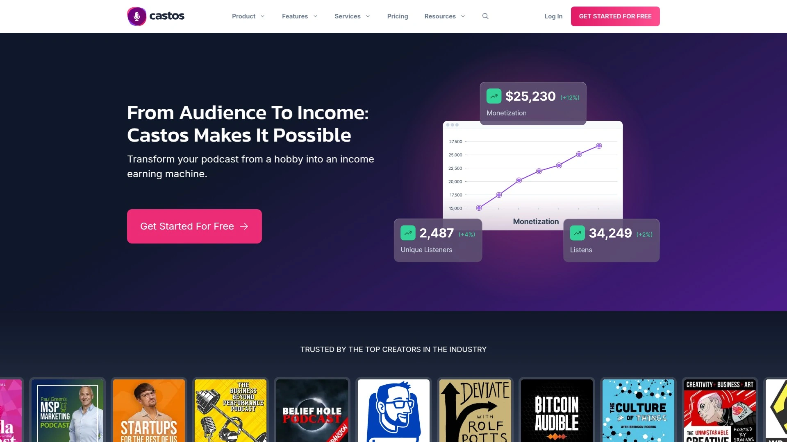

Castos lands at #1 because it removes the nickel-and-dime stress that plagues most podcast hosts—you pay one flat rate and upload as much content as you want, no matter how many episodes or how long they run. The platform automatically distributes your show to Spotify, Apple Podcasts, and all major directories every time you hit publish, saving you the setup headaches. What really sets Castos apart is the monetization suite: you can enable dynamic ad insertion across every episode with one click, accept listener donations, set up recurring subscriptions, and offer private premium content to paying fans.

Castos also automatically uploads your podcast to YouTube as video content, tapping into a whole new audience without extra work on your end. The transcription feature supports 19 languages, boosting discoverability, accessibility, SEO, and giving you written content to repurpose across blogs and social media. If you run your website on WordPress, the Seriously Simple Podcasting plugin integrates seamlessly, making episode management stupidly easy.

The analytics dashboard breaks down what your audience loves so you can create more content that actually resonates. Castos includes a built-in podcast website where listeners can browse episodes, follow your show, and engage with your content—no separate site builder needed. Customer support consistently gets rave reviews, with users calling it "the best tech support in the podcast hosting space" and praising the team for solving issues quickly and thoroughly.

Pricing starts at $19/month or $190/year, with Castos Productions available if you want their team to handle all editing, video clip creation, and episode posting for you. Castos works best for serious podcasters who want unlimited hosting, hybrid public-private content options, and multiple ways to monetize without platform limits.

***

## **[Buzzsprout](https://www.buzzsprout.com)**

Beginner-friendly platform with automatic optimization and detailed performance reports.

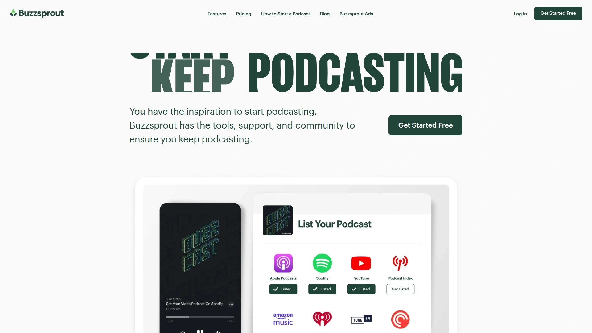

Buzzsprout makes podcasting feel effortless, especially if you're just starting out. You upload your audio file and Buzzsprout automatically handles the rest—it submits episodes to all major podcast directories, ensuring your show reaches listeners on every device and app. The embeddable player works beautifully across all screen sizes, displaying cover art, social sharing buttons, and skip controls without looking clunky.

The platform has been around since 2009 and built a thriving community that includes some of today's top podcasters. If you don't have a website, Buzzsprout creates one for you with customizable design and support for custom domain names. They also offer a dedicated WordPress plugin that makes embedding episodes even simpler.

Buzzsprout's analytics provide detailed insights into podcast performance, helping you understand what episodes resonate and where your audience lives. The Buzzsprout Ads platform enables passive income through automated ad placements. One downside is that paid plans have bandwidth and upload limits, so high-volume creators might hit ceilings faster than with unlimited hosts.

Pricing includes a limited free plan that hosts each episode for 90 days with up to 2 hours monthly, while paid plans start at $12/month for 3 hours of uploads. Buzzsprout is ideal for beginners who value simplicity and detailed support over advanced customization.

***

## **[Transistor](https://transistor.fm)**

Feature-rich platform with unlimited podcasts and automatic YouTube distribution for teams.

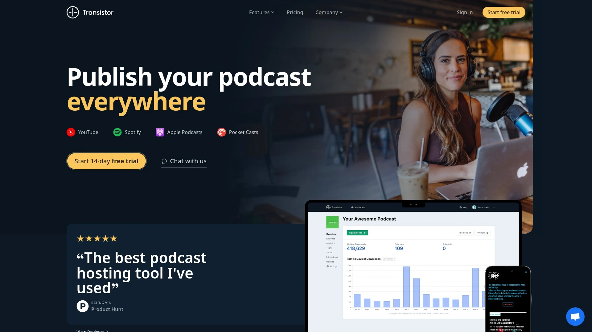

Transistor packs serious power for creators who want to grow and scale. Unlike many hosts, Transistor offers unlimited podcast hosting—no restrictions on hours or episode counts, which is a lifesaver for prolific creators. The platform makes uploading and publishing ridiculously easy, with embed codes that let you drop episodes into WordPress posts and pages instantly.

What stands out is Transistor's support for unlimited team members and collaborators, making it perfect for production teams working on multiple shows. If you don't have a website, they'll quickly create one for you. The platform automatically posts episodes to YouTube and offers dynamic ad insertion for monetization.

Transistor's advanced analytics give you granular visibility into episode performance, listener behavior, and audience growth patterns. The catch is that plans limit monthly downloads, so you'll need to upgrade as your podcast grows. Users love the comprehensive features and professional-grade tools, though the pricing is slightly higher than beginner platforms.

Plans start at $19/month for up to 20,000 downloads monthly, with higher tiers accommodating larger audiences. Transistor works best for podcasters and teams who prioritize unlimited uploads, collaboration features, and built-in growth tools.

***

## **[Podbean](https://www.podbean.com)**

Complete solution with unlimited storage, monetization dashboard, and sponsorship marketplace.

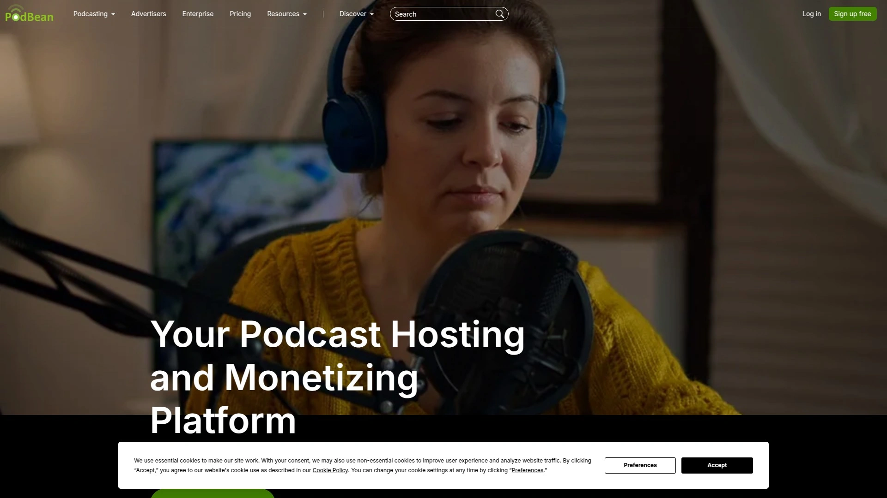

Podbean sits at the top of most "best all-in-one" lists for good reason. The platform offers unlimited storage and unmetered bandwidth, so you never worry about hitting upload caps or paying overage fees. Podbean combines robust hosting with a full suite of monetization tools, including dynamic ad insertion, listener donations, and premium content options.

The PodAds sponsorship marketplace connects you with brands looking for podcast placements, streamlining the sponsorship hunt. Podbean also includes built-in recording and editing tools, eliminating the need for separate software. The monetization dashboard gives you a centralized view of all revenue streams, from ads to listener support.

Distribution is automatic across major platforms, and the analytics help you track listener demographics and episode performance. Podbean's interface is user-friendly, making it accessible for beginners while offering enough depth for experienced podcasters.

Pricing includes a freemium option, with Pro plans starting at $9/month. Podbean is ideal for creators who want a complete podcasting toolkit—hosting, distribution, monetization, and analytics—all in one place.

***

## **[Captivate](https://www.captivate.fm)**

Growth-focused hosting with unlimited shows and lowest monetization fees in the industry.

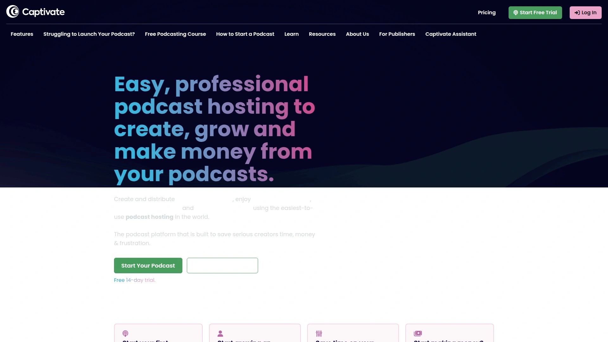

Captivate positions itself as the world's only growth-focused podcast hosting platform. You can host unlimited podcasts under one account, making it perfect for creators managing multiple shows or podcast networks. The platform provides tools to create, grow, and monetize your show with a strong emphasis on audience expansion.

What makes Captivate stand out financially is the fee structure—they charge just 5-12% on monetization features, which is significantly lower than competitors like Spotify (50%) or RedCircle (30-50%). Captivate also provides access to the DAX (Digital Audio Exchange) marketplace, connecting you with premium advertisers.

The platform includes advanced analytics, automatic distribution, and customizable podcast websites with your own domain. Users appreciate the balance between powerful features and straightforward usability.

Pricing starts around $17/month, offering strong value given the unlimited hosting and low monetization fees. Captivate works best for podcasters focused on financial growth who want to keep more of their revenue while scaling their shows.

***

## **[Libsyn](https://libsyn.com)**

Trusted veteran platform with flexible scheduling and enterprise-grade reliability.

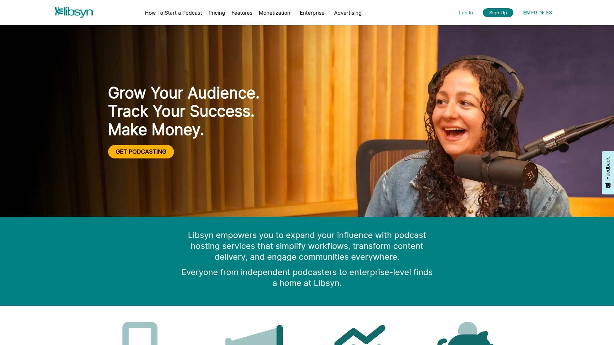

Libsyn is one of the old guard in podcast hosting, serving tens of thousands of customers with quality, reliable, and extremely knowledgeable service. The platform prides itself on distribution flexibility—their Destinations feature lets you publish to different directories independently, scheduling each to go live at specific days and times down to the minute.

What podcasters love is that Libsyn doesn't alter your files—what you upload is exactly what listeners download, maintaining complete control over audio quality. They do provide tools to add metadata if you choose, but they won't touch your content without permission.

Libsyn offers detailed statistics and excellent service, with a reputation for reliability that big media companies, government agencies, and podcast networks trust. The Libsyn Ads program provides advanced monetization integrations for established shows.

Pricing starts at $5/month for 162MB of uploads (roughly three hours), though the $15/month plan with 324MB is more realistic for weekly podcasters. Enterprise offerings are available with custom pricing. Libsyn is ideal for professional podcasters who value reliability, flexibility, and complete file control.

***

## **[RedCircle](https://www.redcircle.com)**

Monetization-first platform with unlimited hosting and fast payout systems.

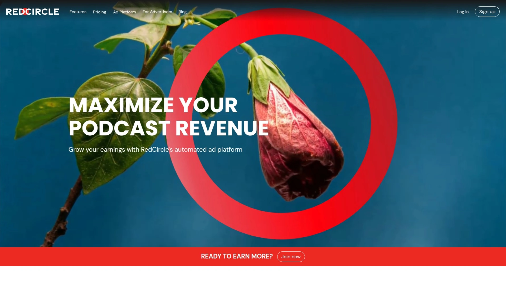

RedCircle built its reputation on helping independent creators make money from podcasting. The platform offers unlimited hosting and bandwidth across all plans, including the free tier, removing storage anxiety completely. RedCircle's RAP (RedCircle Ads Platform) uses programmatic and host-read ad insertion to monetize episodes dynamically.

The cross-promotion marketplace connects you with other podcasters for audience-sharing opportunities, helping you grow listeners organically. RedCircle also supports subscriptions, exclusive content, and listener donations as additional revenue streams. What users highlight is the fast payout system—you get paid quickly without waiting months for minimum thresholds.

The platform automatically generates videos for episodes with one-click distribution to YouTube, expanding your reach beyond audio-only platforms. Analytics range from standard on free plans to premium on paid tiers, providing insights into growth, revenue, and listener behavior.

RedCircle's free Core plan includes unlimited hosting, distribution, and basic monetization features. Paid plans start at $9/month for Growth and $30/month for Pro, with Enterprise available for networks. RedCircle works best for podcasters whose main goal is monetization and who want multiple income streams in one platform.

***

## **[Acast](https://www.acast.com)**

Leading monetization platform connecting creators with 3,300+ premium brands.

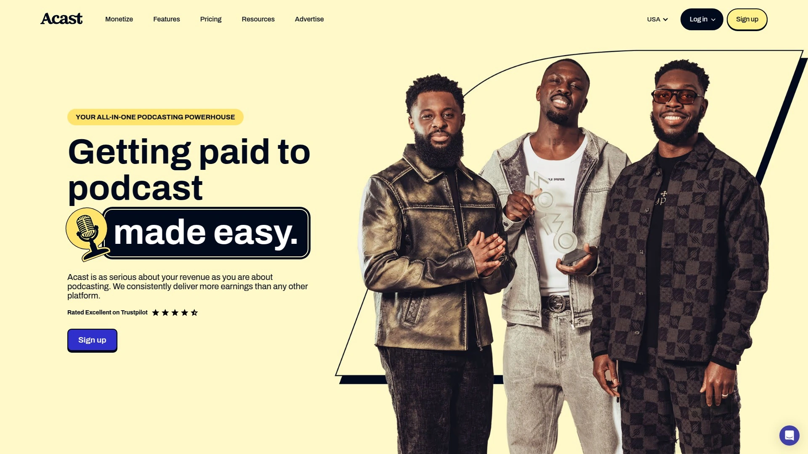

Acast has positioned itself as the best podcast monetization platform, connecting creators with premium advertisers to drive reliable revenue. The platform provides access to a network of 3,300+ brands looking for podcast placements, dramatically simplifying the sponsorship hunt. Acast supports advertisements, sponsorships (on the Influencer plan), and subscription options.

The dynamic ad insertion technology seamlessly integrates ads into episodes without awkward transitions, maintaining listener experience while generating income. Acast's focus is clearly on helping podcasters earn more through sophisticated ad placement and brand connections.

The platform handles hosting and distribution alongside monetization, offering a complete solution for creators prioritizing revenue. Pricing runs around $14.99/month, with Acast taking a 15% cut of monetization revenue.

Acast works best for podcasters with growing audiences who want access to premium advertisers and prefer a platform that handles ad logistics automatically.

***

## **[RSS.com](https://rss.com)**

All-round host with one-click publishing and seamless multi-platform distribution.

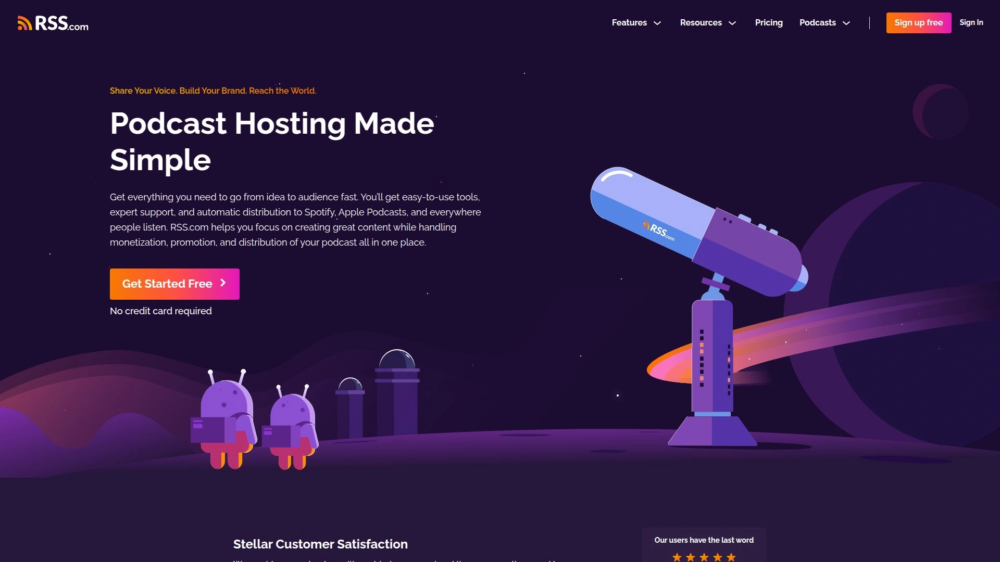

RSS.com offers a straightforward, all-round hosting solution for beginners and professionals alike. The platform features one-click publishing that shares audio content effortlessly across Apple Podcasts, Spotify, and other major platforms. RSS.com handles distribution management, engagement tracking, and multi-channel distribution with minimal manual work.

The platform supports audio recording, file uploads, bulk uploading, and data storage management in a centralized dashboard. RSS.com provides website management tools so you can create a podcast homepage without needing separate hosting.

Users appreciate the platform's ease of use and the ability to manage multiple shows from one account. The interface is clean, making it accessible for new podcasters while offering enough features for experienced creators.

Pricing details vary by plan, with options scaling based on upload volume and feature needs. RSS.com is ideal for podcasters who want reliable hosting and distribution without overwhelming complexity.

***

## **[Blubrry](https://www.blubrry.com)**

WordPress-integrated host with robust analytics and plugin-based management.

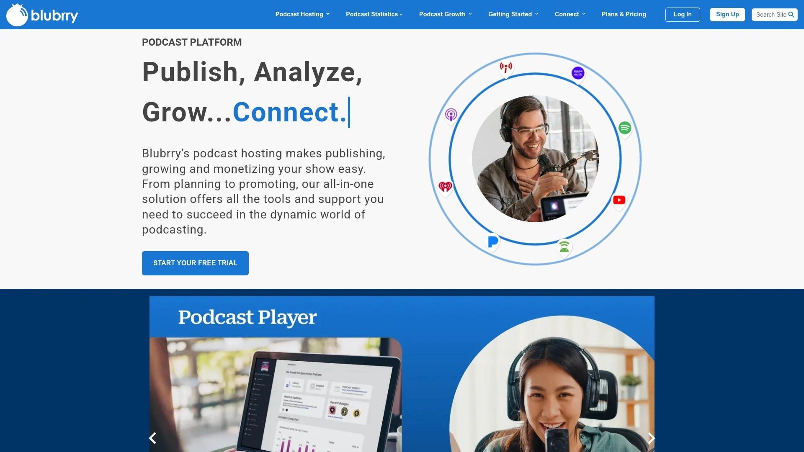

Blubrry stands out for its tight integration with WordPress, making it the go-to choice for podcasters who already run their websites on the platform. The Blubrry plugin lets you manage your entire podcast directly from your WordPress dashboard, uploading episodes, editing metadata, and publishing without leaving your site.

The platform provides robust analytics that track listener demographics, device usage, and episode performance in granular detail. Blubrry is known for reliable hosting with strong customer support and a long track record in the podcasting space.

Distribution is automatic to all major directories, and the platform offers tools for audio editing, social sharing, and website management. Blubrry also supports video podcasting, making it versatile for multimedia content.

Pricing starts at $12/month, with plans scaling based on storage needs. Blubrry is best for WordPress users who want seamless plugin-based podcast management and detailed analytics.

***

## **[Spotify for Podcasters](https://podcasters.spotify.com)**

Free unlimited hosting with direct Spotify integration and Riverside recording tools.

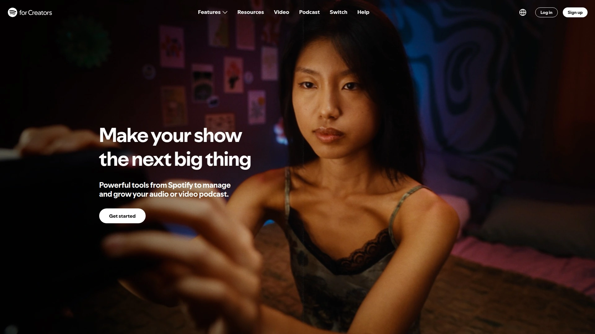

Spotify for Podcasters (formerly Anchor) offers completely free unlimited hosting, removing the biggest barrier to entry for new podcasters. You can upload as many episodes as you want with no storage limits or monthly fees, making it incredibly accessible. The platform automatically distributes your show to major listening apps, not just Spotify.

The recent integration with Riverside allows you to record high-quality remote podcasts with up to 10 participants, capturing video and audio locally for crisp output. After recording, you can edit using Riverside's text-based editor, then publish straight to Spotify.

Spotify for Podcasters now supports video podcasts, short-form video clips, and custom thumbnails to improve discovery. The platform's analytics track demographics, listening behavior, episode performance, and device usage. However, the analytics aren't IAB-certified, which some advertisers consider less credible.

The main downside is Spotify's 50% cut of automated ad revenue, which is significantly higher than most competitors. The platform is completely free to use, but you sacrifice control over monetization splits.

Spotify for Podcasters works best for beginners, hobbyists, and anyone launching a new show who wants zero upfront costs and access to Spotify's massive audience.

---

## **[CoHost](https://www.cohostpodcasting.com)**

B2B-focused platform with company listening data and advanced audience insights.

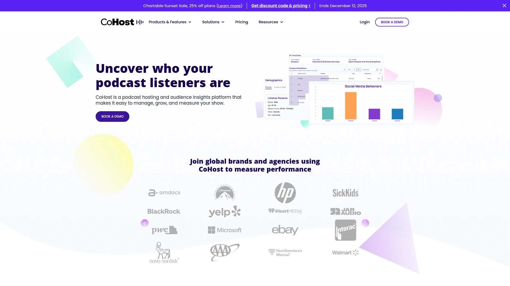

CoHost takes podcast analytics to another level with deep audience insights that include demographics, firmographics, and psychographics. The platform shows you which companies are listening to your podcast, their size, industry, location, and even the job roles and seniority of listeners. This is gold for B2B podcasters trying to understand corporate audiences.

CoHost Tracking Links let you evaluate which marketing channels actually grow your podcast, connecting clicks to downloads so you know what works. The platform tracks consumption rates, new listener metrics, and unique listeners to show which content resonates most.

Beyond analytics, CoHost handles podcast hosting, management, publishing, and team organization effortlessly. You can create a customizable podcast website that boosts discoverability, and the platform offers dynamic ad insertion for pre and post-roll monetization. CoHost even automatically transforms your podcast into additional content you can share across channels.

The team handles the entire migration process if you're switching from another host. Pricing requires contacting CoHost for a quote, but the platform is designed for brands, agencies, and serious podcasters who need sophisticated insights.

CoHost is ideal for B2B podcasters, marketing teams, and anyone who needs deep audience intelligence beyond basic download numbers.

***

## **[Spreaker](https://www.spreaker.com)**

Live broadcasting specialist with real-time monetization and multi-platform streaming.

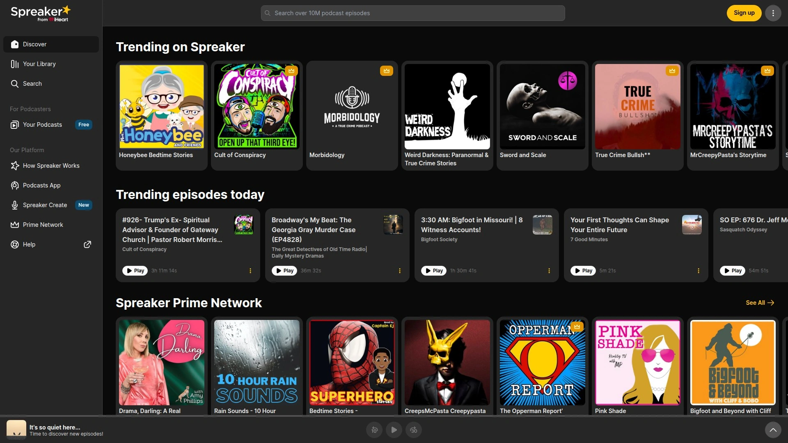

Spreaker's standout feature is live podcasting—you can broadcast episodes in real time to your audience, creating interactive experiences that recorded shows can't match. The platform offers monetization features on all paid plans, letting you start earning from day one. If you have an existing catalog, you can even monetize previous episodes through dynamic ad insertion.

Spreaker provides a centralized CMS (Content Management System) dashboard for recording, live broadcasting, editing, hosting, distributing, and analyzing your podcast. The platform handles audio recording, file uploads, distribution management, and engagement tracking all in one place.

Users appreciate the ability to stream live content while building an on-demand library simultaneously. Spreaker supports social sharing and multi-channel distribution, ensuring your episodes reach listeners wherever they consume content.

Pricing starts at $20/month for the Broadcaster plan, which includes monetization access and live streaming capabilities. Spreaker works best for podcasters who want live broadcasting, real-time audience interaction, and early-stage monetization.

***

## **[Simplecast](https://simplecast.com)**

Unlimited storage platform with download-based pricing and customizable podcast websites.

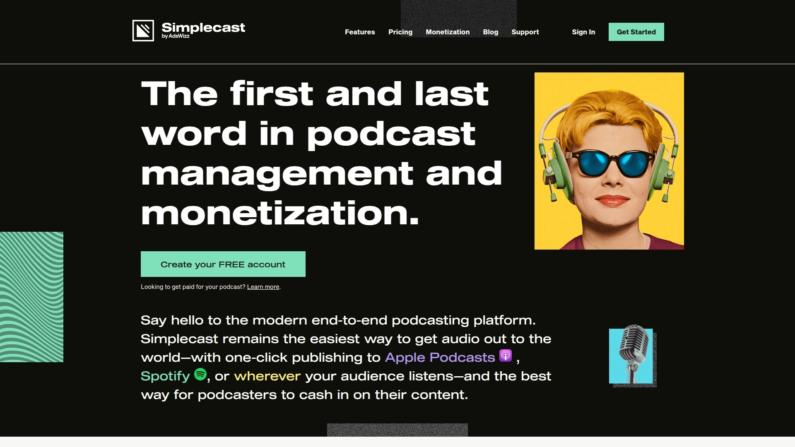

Simplecast offers unlimited storage and uploads across all plans, meaning you can publish as much content as you want without paying extra. Instead of charging by storage, they base pricing on monthly downloads, with the cheapest plan supporting up to 20,000 downloads. This model works great for podcasters with larger files or frequent publishing schedules.

The platform provides a customizable podcast website with the option to attach a custom domain, giving your show a professional home. You can manage multiple shows from one Simplecast account, though you'll pay monthly for each show hosted.

Simplecast includes an embeddable podcast player that works across devices and integrates easily into websites. The interface scores high on ease of use, making it accessible even for beginners. However, some users report that promised platform upgrades and analytics improvements took longer to deliver than expected.

Pricing scales based on download volume rather than storage, making it cost-effective for creators with smaller audiences but high production output. Simplecast is ideal for podcasters who publish frequently or have long episodes and prefer unlimited storage over download caps.

***

## **[Riverside](https://riverside.fm)**

High-quality recording platform with local capture and text-based editing tools.

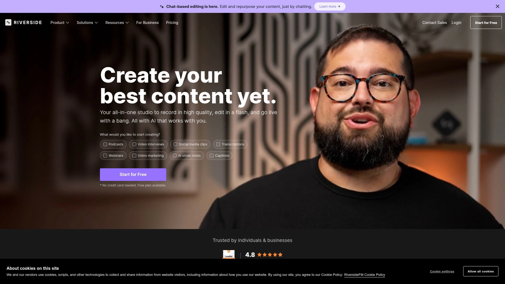

Riverside focuses on the creation side of podcasting, offering studio-quality remote recording that captures up to 4K video and 48kHz WAV audio locally on each participant's device. This means your audio and video quality stay crisp regardless of internet connection issues. You can record with up to 10 participants remotely, each on separate tracks.

The text-based editor makes editing incredibly fast—you delete words in the automatically generated transcript, and the corresponding video syncs automatically. Riverside's AI tools enhance audio, cut filler words, and clean up long pauses with minimal manual work.

The platform integrates directly with Spotify for Podcasters, allowing you to record, edit, and publish seamlessly. Riverside also generates AI b-roll, automatic transcripts, and custom layouts to polish your podcast before publishing.

Some users report occasional technical frustrations, particularly with refresh issues during recordings. However, the overall quality and convenience make it a top choice for remote podcast recording.

Pricing starts at $15 per user per month, with Riverside serving as a recording and editing tool that pairs with hosting platforms like Spotify or Castos. Riverside works best for podcasters prioritizing production quality and remote collaboration.

---

## **[Audioboom](https://audioboom.com)**

Advertising-focused host with dynamic ad insertion and SHOWCASE technology.

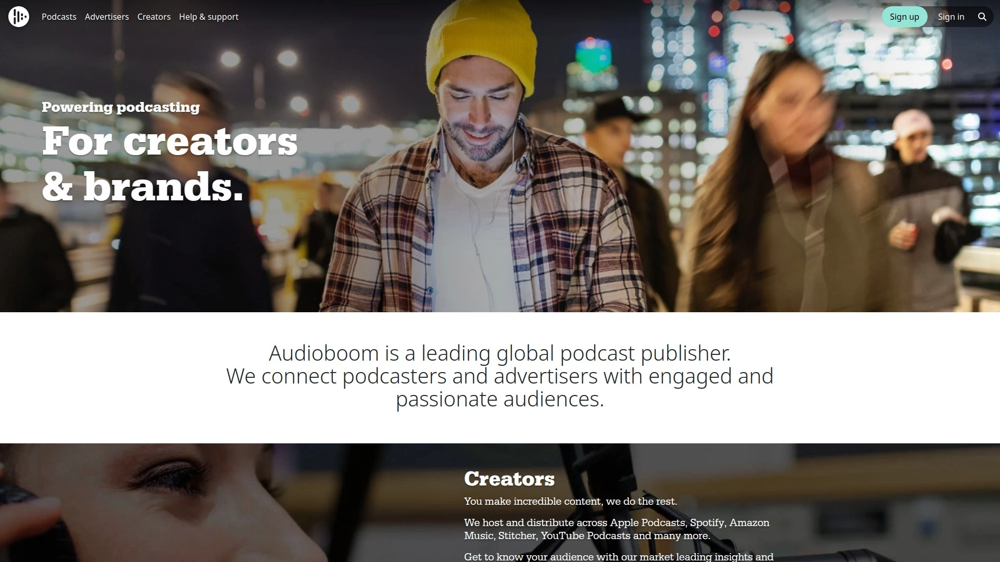

Audioboom is ideal for podcasters looking to tap into podcast advertising opportunities. The platform offers unlimited uploads and private podcasting options, making it flexible for both public and exclusive content. Podcasters with over 10,000 plays per episode gain access to powerful advertising tools, including dynamic ad insertion, sponsorship opportunities, and branded content deals.

Audioboom's SHOWCASE technology uses dynamic ad insertion to execute campaigns seamlessly with minimal involvement from podcasters. You can choose exactly where mid-roll ad points fall in your content to avoid awkward interruptions, while pre-roll and post-roll placements are handled automatically.

The LIRICAL platform manages 'host read' live spots once your show attracts sponsors, handling booking, billing, and payments on your behalf. Audioboom also offers advanced analytics on paid plans, breaking down audience demographics, listening devices, and geographic locations.

The platform supports private podcasts accessible only to people you share the RSS feed with, perfect for exclusive Patreon content. The embeddable media player is responsive across devices and compatible with private podcasts.

Pricing includes podcast and podcast pro subscription plans, with the pro tier adding contributor management for production teams. Audioboom is best for established podcasters focused on advertising revenue who want sophisticated ad tech and sponsor management.

***

## FAQ

**Can podcast hosting platforms handle both audio-only and video podcasts?**

Yes, several platforms support video podcasting alongside traditional audio. Castos offers both audio and video podcast hosting with automatic YouTube uploads. Spotify for Podcasters now supports video podcasts, short-form clips, and custom thumbnails. Platforms like Riverside specialize in high-quality video recording with 4K capture, while most traditional hosts focus primarily on audio with video as a secondary feature.

**How do unlimited hosting plans actually work when platforms charge monthly fees?**

Unlimited hosting means you can upload as many episodes as you want without storage caps, but platforms may limit other factors. Castos and Podbean offer unlimited storage for a flat monthly rate with no episode or bandwidth limits. Transistor provides unlimited podcasts and storage but caps monthly downloads, requiring upgrades as your audience grows. Some platforms charge based on downloads rather than storage, like Simplecast, which offers unlimited uploads but prices by listener volume.

**What's the difference between dynamic ad insertion and pre-recorded ads in episodes?**

Dynamic ad insertion places ads into episodes automatically after publishing, allowing you to update or swap ads without re-uploading files. This lets you monetize old episodes with current sponsors and target ads based on listener location or behavior. Pre-recorded ads are baked into your audio file permanently, meaning every listener hears the same ad forever regardless of when they download the episode. Dynamic insertion gives more flexibility and higher revenue potential, especially for back catalog monetization.

---

## Conclusion

Picking a podcast host doesn't have to feel like choosing between a dozen identical boxes with slightly different price tags. Each platform serves different needs—some prioritize beginner simplicity, others focus on monetization firepower, and a few specialize in live broadcasting or B2B analytics. The best choice depends on your publishing frequency, audience size, monetization goals, and whether you value unlimited storage over advanced features.

For most podcasters building a sustainable show with serious monetization potential, **[Castos](https://castos.com)** delivers the strongest combination of unlimited hosting, automatic YouTube distribution, multiple revenue streams, and WordPress integration without platform limits or download caps. Whether you're launching your first episode or scaling a podcast network, the right hosting platform turns your audio files into a discoverable, monetizable show that actually reaches listeners.
